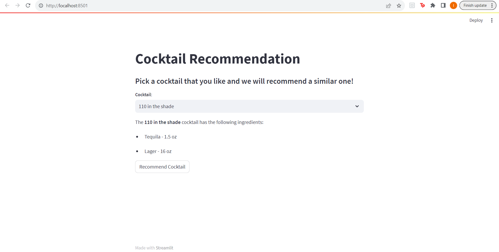
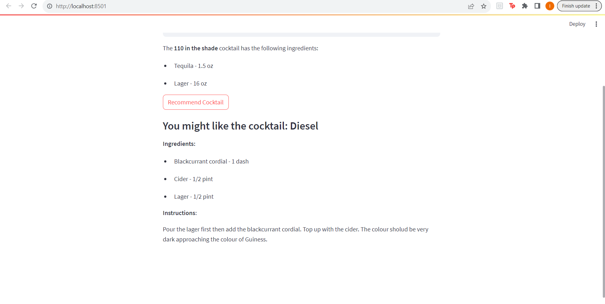

### Cocktail Recommendation

In this analysis, I:

* Scrape cocktail information from the web (cocktaildb API)
* Develop a simple NLP algorithm that finds cocktails that are similar to each other based on their ingredients
* Create a web application using the streamlit package on which users can pick a cocktail that they like and a similar cocktail will be recommended to them.

The file **scrape.py** includes the code for scraping and the NLP model.
In the files **app.py** and **recommend_page.py** the streamlit application is being developed. 

Below are screenshots from the streamlit app:

1. Pick a cocktail:

2. After clicking on the **Recommend Cocktail** button, a similar cocktail is recommended:

